# EEG-Based ADHD Detection with Dynamic Envelope Connectivity and a Hybrid Spatio-Temporal Graph Transformer

## Overview

This repository presents a reproducible computational study for ADHD detection from EEG signals using dynamic functional connectivity. The analysis focuses on band-limited theta and beta amplitude-envelope connectivity, subject-level validation, and a proposed **Hybrid Multihead Spatio-Temporal Graph Transformer Index** model.

The project is designed as a complete scientific workflow rather than a minimal model demo. It includes dataset auditing, signal preprocessing, dynamic connectivity construction, model benchmarking, uncertainty estimation, internal validation, and publication-quality Matplotlib figures. Classification metrics and distribution-level separability measures are reported separately to avoid overstating the diagnostic meaning of scalar index separation.

## Main Notebook

The complete executable notebook is:

**`EEG_ADHD_Dynamic_Envelope_Connectivity_Hybrid_ST_Graph_Transformer_for_GitHub.ipynb`**

Notebook describe the same scientific analysis. The GitHub copy keeps the tables and figures under the corresponding cells while compressing embedded images to keep the file suitable for repository hosting.

## Dataset

The analysis uses a tabular EEG dataset in CSV format derived from the public ADHD/control EEG data associated with Nasrabadi, Allahverdy, Samavati, and Mohammadi. The dataset contains subject identifiers, class labels, and 19 EEG channels.

| Dataset property | Value |
|---|---:|
| Rows | 2,166,383 |
| Subjects | 121 |
| Control subjects | 60 |
| ADHD subjects | 61 |
| EEG channels | 19 |
| Class encoding | Control = 0; ADHD = 1 |
| Primary computational sampling frequency | 500 Hz |

The dataset is treated as anonymized secondary research data. No personal identifying information is used by the analysis.

## EEG Channels

The channel set includes:

`Fp1`, `Fp2`, `F3`, `F4`, `C3`, `C4`, `P3`, `P4`, `O1`, `O2`, `F7`, `F8`, `T7`, `T8`, `P7`, `P8`, `Fz`, `Cz`, `Pz`.

## Analysis Workflow

```mermaid
flowchart LR
    A[CSV EEG data] --> B[Data integrity audit]
    B --> C[Subject-level split]
    C --> D[Signal preprocessing]
    D --> E[Theta and beta filtering]
    E --> F[Hilbert amplitude envelopes]
    F --> G[Window-level connectivity]
    G --> H[Dynamic connectivity sequences]
    H --> I[Network-index models]
    I --> J[Subject-level aggregation]
    J --> K[Metrics, uncertainty, and figures]
```

## Preprocessing and Feature Construction

The final model input is based on theta and beta amplitude-envelope connectivity. Raw-amplitude correlation is used only for descriptive signal inspection and is not used as the final model feature representation.

| Stage | Description |
|---|---|
| Subject-wise demeaning and detrending | Reduces baseline offsets and slow drifts before connectivity estimation. |
| Robust amplitude clipping | Applies median and MAD-based clipping to limit extreme amplitude excursions. |
| Band-pass filtering | Extracts theta and beta activity for envelope-based connectivity. |
| Hilbert envelope extraction | Converts band-limited signals into amplitude-envelope time series. |
| Windowing | Builds overlapping EEG windows with label consistency checks. |
| Connectivity construction | Computes inter-channel correlation matrices from amplitude envelopes. |
| Dynamic sequence construction | Groups window-level connectivity matrices into temporal sequences. |
| Edge-vector representation | Uses upper-triangular connectivity edges for vector-based models. |
| Training-only standardization | Computes feature mean and standard deviation on train only, then applies them to validation and test. |

## Evaluated Models

The study compares lightweight, graph-based, recurrent, convolutional, and hybrid spatio-temporal models under the same subject-level evaluation protocol.

| Model family | Role in the benchmark |
|---|---|
| Linear Network Index | Simple linear baseline using standardized connectivity edges. |
| Sparse Oscillatory Index | L1-regularized sparse connectivity baseline. |
| Global Graph-Metric Network Index | Logistic model using graph summary metrics. |
| GRU Dynamic Connectivity Index | Recurrent model for temporal connectivity sequences. |
| Static GCN Brain Network Index | Graph convolutional model using static connectivity. |
| Spatio-Temporal GCN Brain Network Index | GCN model using dynamic connectivity structure. |
| Hybrid Multihead Spatio-Temporal Graph Transformer Index | Proposed model combining transformer, GRU, and fused dynamic connectivity features. |
| Proposed model ablation | Reduced-regularization version of the proposed architecture. |

## Proposed Hybrid Model

The proposed model produces a scalar subject-level network index from dynamic theta/beta connectivity. It combines a transformer branch for multi-head temporal attention, a GRU branch for sequential dynamics, and a fusion module for the final scalar index.

| Setting | Value |
|---|---:|
| Input dimension | 342 |
| Output dimension | 1 |
| Hidden size | 64 |
| Transformer heads | 4 |
| Transformer encoder layers | 1 |
| GRU hidden size | 64 |
| Dropout | 0.25 |
| Optimizer | AdamW |
| Learning rate | 0.0004 |
| Weight decay | 0.0003 |
| Batch size | 64 |
| Maximum epochs | 16 |
| Early stopping | patience = 5 |

The sparse oscillatory baseline uses L1-regularized logistic regression with `C = 0.25` and `max_iter = 5000`.

## Subject-Level Evaluation

The main fixed split separates subjects before any window-level or sequence-level modeling. This prevents the same child from contributing EEG segments to more than one partition.

| Split | Control subjects | ADHD subjects | Control windows | ADHD windows | Control sequences | ADHD sequences |
|---|---:|---:|---:|---:|---:|---:|
| train | 42 | 42 | 2,553 | 3,271 | 451 | 598 |
| validation | 9 | 9 | 552 | 692 | 97 | 125 |
| test | 9 | 10 | 552 | 659 | 98 | 117 |

The independent test set contains 19 subjects. Metrics are computed after subject-level aggregation of sequence-level model scores.

## Main Classification Results

The proposed hybrid model ranks highest on the fixed subject-level test split. The absolute performance is moderate, which is expected for a small independent test set and sensor-space EEG connectivity analysis.

| Model | Accuracy | Balanced accuracy | Sensitivity | Specificity | Precision | F1-score | AUC-ROC |
|---|---:|---:|---:|---:|---:|---:|---:|
| Proposed Hybrid ST Graph Transformer | **0.63** | **0.62** | 0.80 | 0.44 | 0.62 | **0.70** | **0.74** |
| Proposed model ablation | 0.63 | 0.62 | 0.80 | 0.44 | 0.62 | 0.70 | 0.73 |
| GRU dynamic index | 0.58 | 0.57 | 0.70 | 0.44 | 0.58 | 0.64 | 0.66 |
| Global graph-metric index | 0.58 | 0.57 | 0.80 | 0.33 | 0.57 | 0.67 | 0.63 |
| Linear network index | 0.53 | 0.52 | 0.70 | 0.33 | 0.54 | 0.61 | 0.47 |
| Spatio-temporal GCN index | 0.53 | 0.50 | 1.00 | 0.00 | 0.53 | 0.69 | 0.41 |
| Static GCN index | 0.53 | 0.50 | 1.00 | 0.00 | 0.53 | 0.69 | 0.40 |
| Sparse oscillatory index | 0.47 | 0.47 | 0.60 | 0.33 | 0.50 | 0.55 | 0.47 |

## Bootstrap Uncertainty

Bootstrap confidence intervals are computed at the subject level. The proposed model shows promising discrimination, but the uncertainty remains wide because only 19 subjects are available in the fixed independent test split.

| Metric | Estimate | 95% bootstrap CI |
|---|---:|---:|
| Accuracy | 0.63 | 0.42-0.84 |
| Balanced accuracy | 0.62 | 0.42-0.83 |
| Sensitivity | 0.80 | 0.50-1.00 |
| Specificity | 0.44 | 0.11-0.78 |
| Precision | 0.62 | 0.47-0.80 |
| F1-score | 0.70 | 0.50-0.86 |
| AUC-ROC | 0.74 | 0.49-0.94 |

## Separability Results

Separability metrics describe the distribution of the scalar network index. They are not classification metrics and should not be interpreted as direct diagnostic accuracy.

| Model | Mean Control | Mean ADHD | Delta mean | Cohen's d | Pearson r | Overlap | Silhouette |
|---|---:|---:|---:|---:|---:|---:|---:|
| Proposed Hybrid ST Graph Transformer | -0.21 | 0.95 | 1.16 | **0.73** | **0.36** | **0.72** | 0.03 |
| Proposed model ablation | -0.22 | 1.01 | 1.23 | 0.66 | 0.33 | 0.74 | 0.01 |
| GRU dynamic index | -0.21 | 0.28 | 0.49 | 0.66 | 0.33 | 0.74 | -0.02 |
| Global graph-metric index | 0.22 | 0.59 | 0.37 | 0.55 | 0.28 | 0.78 | -0.04 |
| Linear network index | 0.29 | 0.65 | 0.36 | 0.04 | 0.02 | 0.98 | -0.04 |
| Sparse oscillatory index | 0.08 | 0.57 | 0.49 | 0.09 | 0.05 | 0.96 | -0.04 |
| Static GCN index | 0.24 | 0.24 | -0.00 | -0.49 | -0.25 | 0.80 | 0.01 |
| Spatio-temporal GCN index | 0.26 | 0.26 | -0.00 | -0.38 | -0.20 | 0.85 | -0.01 |

## Additional Validation

The notebook includes additional validation blocks to estimate stability beyond the fixed test split.

| Validation | Result | Interpretation |
|---|---|---|
| Subject leakage check | No overlap between train, validation, and test subjects. | Confirms that windows and sequences are not split across partitions for the same subject. |
| Lightweight LOSO | Sparse oscillatory index: accuracy 0.74, AUC-ROC 0.79 across 121 subjects. | Indicates that sparse connectivity information carries subject-level signal under leave-one-subject-out evaluation. |
| Deep LOSO | Proposed hybrid model: accuracy 0.72, balanced accuracy 0.72, sensitivity 0.82, specificity 0.62, AUC-ROC 0.78 across 121 subjects. | Provides internal leave-one-subject-out evidence for the proposed architecture. |
| 128 Hz sensitivity rerun | Proposed hybrid model: test accuracy 0.68, balanced accuracy 0.68, sensitivity 0.80, specificity 0.56, AUC-ROC 0.81. | Shows that the main conclusion is not restricted to the 500 Hz timing interpretation. |

## Sampling-Frequency Handling

The primary workflow uses 500 Hz for filter design and time-window interpretation. Because public dataset descriptions may refer to 128 Hz, the notebook also includes:

- an evidence table summarizing local frequency information;
- a 500 Hz versus 128 Hz timing-impact table;
- a fixed-split 128 Hz sensitivity rerun for the proposed hybrid model.

This repository therefore reports the computational frequency explicitly and provides an alternative 128 Hz analysis. The raw acquisition or redistribution provenance should still be checked against the dataset source when preparing formal study documentation.

## Generated Figures

All figures are generated with Matplotlib, Times New Roman styling, readable labels, and 350 dpi export. Key figures include:

- raw versus preprocessed EEG examples;
- theta, beta, and joint envelope-connectivity matrices;
- relative spectral power maps;
- subject-level ROC curves;
- model index scatter and density distributions;
- balanced accuracy and AUC-ROC comparisons;
- sensitivity and specificity comparison;
- confusion matrices;
- sparse edge-weight heatmaps;
- dynamic-state occupancy and PCA summaries.

## Interpretation

The results support preliminary subject-level ADHD/control discrimination from dynamic EEG envelope connectivity. The proposed hybrid model performs best among the evaluated models on the fixed test split and remains competitive under internal leave-one-subject-out validation.

The findings should be interpreted as proof-of-concept evidence for a screening-oriented decision-support model. They do not establish a standalone clinical diagnostic system. External validation, harmonized acquisition metadata, behavioral correlates, and stronger physiological controls are needed before clinical deployment.

## Technical Caveats

| Caveat | Practical meaning |
|---|---|
| Small fixed test set | Confidence intervals are wide and single-split estimates can vary. |
| Single dataset | Generalization to other acquisition settings is not yet established. |
| Sensor-space connectivity | Pearson and envelope correlations can reflect volume leakage or shared sources. |
| Sampling-frequency provenance | The computational workflow is explicit, but dataset-source descriptions should be verified. |
| No event-locked behavioral modeling | The analysis focuses on resting/task EEG connectivity features rather than event-locked cognitive responses. |

## Reproducibility

The notebook is designed to run sequentially from the first cell to the last cell in a Python/Jupyter environment with the scientific Python stack installed.

Core dependencies include:

- `numpy`
- `pandas`
- `scipy`
- `scikit-learn`
- `matplotlib`
- `networkx`
- `torch`
- `nbformat`
- `nbclient`
- `openpyxl`

The analysis uses fixed random seeds, subject-level splits, training-only standardization, and Matplotlib-only visualization.

## Repository Contents

| Item | Description |
|---|---|
| Main analysis notebook | Full executable scientific workflow with all outputs. |
| GitHub notebook copy | Size-optimized notebook with embedded tables and figures. |
| CSV EEG dataset | Tabular EEG data used for computation. |
| Generated figures | Publication-quality PNG outputs. |
| Generated tables | CSV and XLSX summaries of metrics, validation checks, and model settings. |
| Reproducibility materials | Package metadata, availability statements, and output manifest. |

## Recommended Use

This repository is suitable for:

- reproducing the EEG preprocessing and dynamic connectivity pipeline;
- inspecting subject-level ADHD/control classification results;
- comparing graph, recurrent, sparse, and hybrid connectivity models;
- reusing the Matplotlib figure-generation workflow;
- extending the analysis with independent datasets or additional physiological connectivity measures.

## Citation

If this repository or its outputs are used, cite the original EEG ADHD/control dataset source and the associated scientific work describing the Hybrid Multihead Spatio-Temporal Graph Transformer Index model.
